# Namma-Santhe Ledger App 📔

> **An offline-first digital khata (ledger) app for rural Indian vendors to seamlessly digitize credit tracking operations.**

Namma-Santhe Ledger is an Android application designed to replace traditional paper-based "udari" (credit) tracking with a mobile-first, robust solution. The app helps vendors maintain reliable records, avoid calculation errors, and securely track outstanding payments. 

---

## 📸 App Walkthrough

### 🌟 Onboarding & Setup
| Welcome Screen | Cloud Backup | Get Started |
|:---:|:---:|:---:|
| 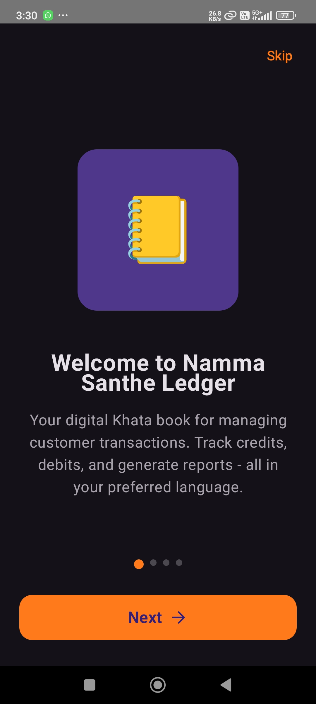 | 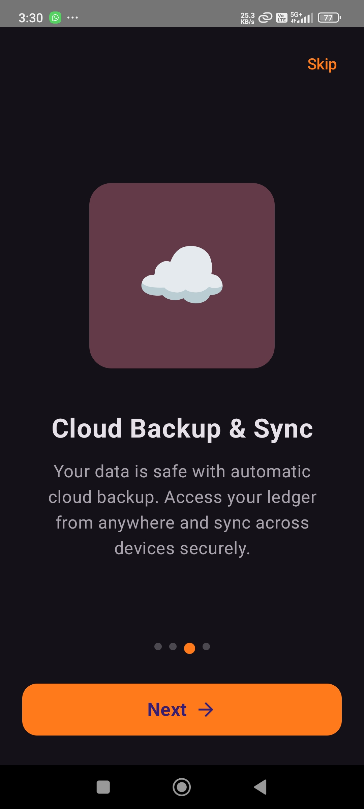 | 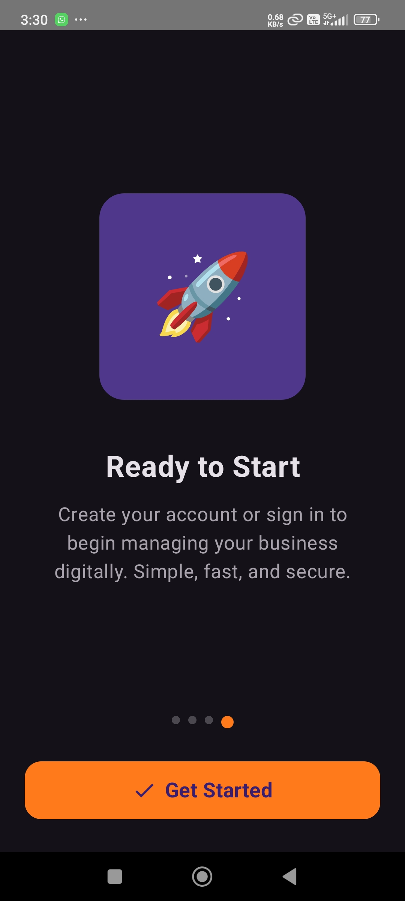 |
| *Personalized welcome to Namma Santhe Ledger.* | *Overview of secure cloud synchronization features.* | *Final onboarding step to begin your digital journey.* |

### 🔐 Authentication
| Create Account | Sign In |
|:---:|:---:|
| 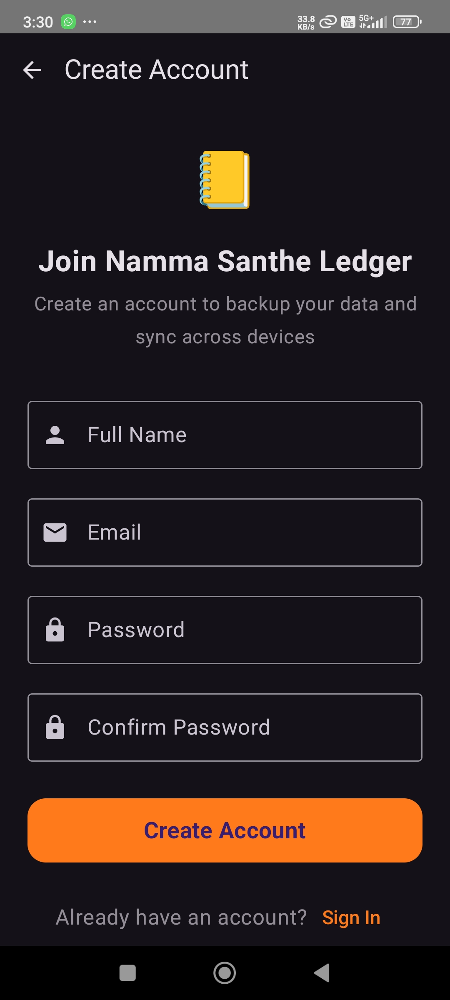 | 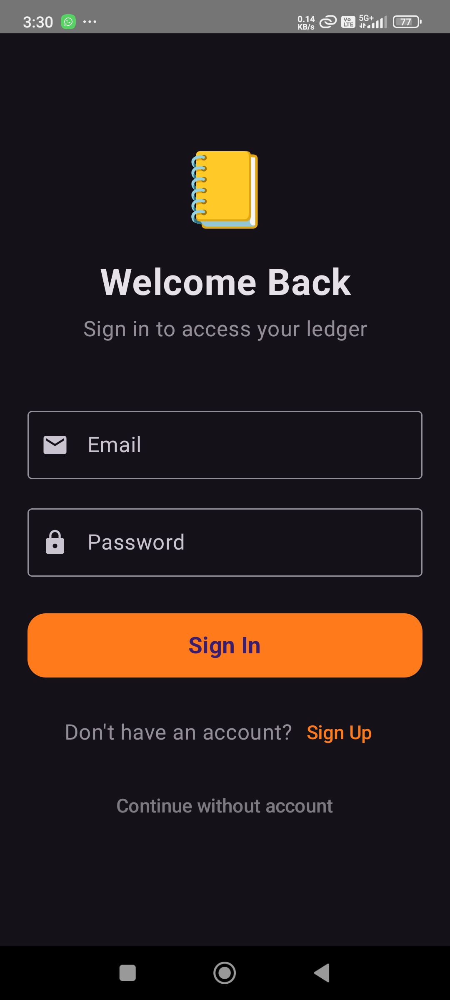 |
| *Easy registration to secure your data.* | *Secure login for existing users.* |

### 📊 Dashboard & Management
| Main Dashboard | Customer List | Add New Customer |
|:---:|:---:|:---:|
| 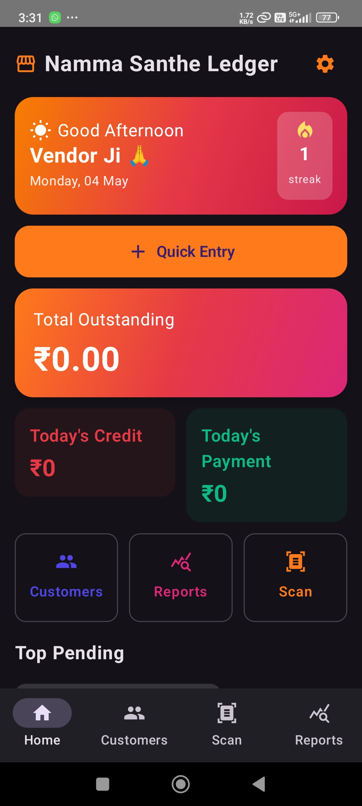 | 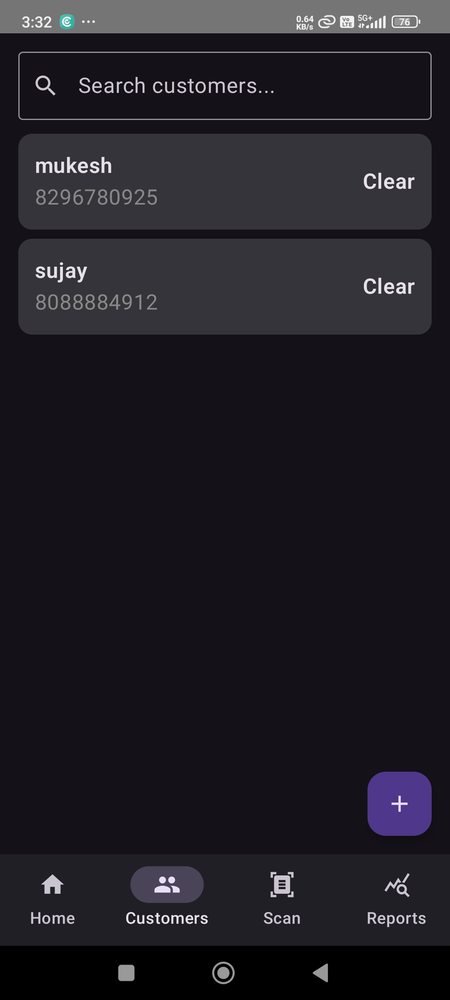 | 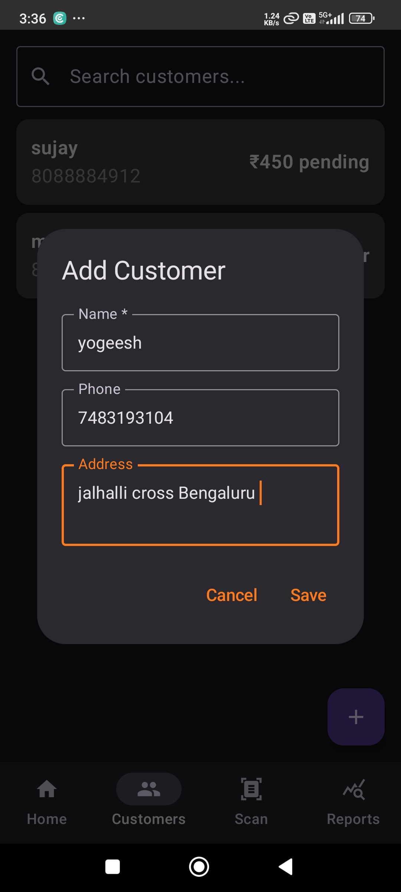 |
| *Real-time overview of outstanding, credits, and payments.* | *Quick search and management of all customers.* | *Streamlined form to add new business contacts.* |

### 💸 Transactions & Profile
| Customer Profile | Recording Credit | Balance Update |
|:---:|:---:|:---:|
| 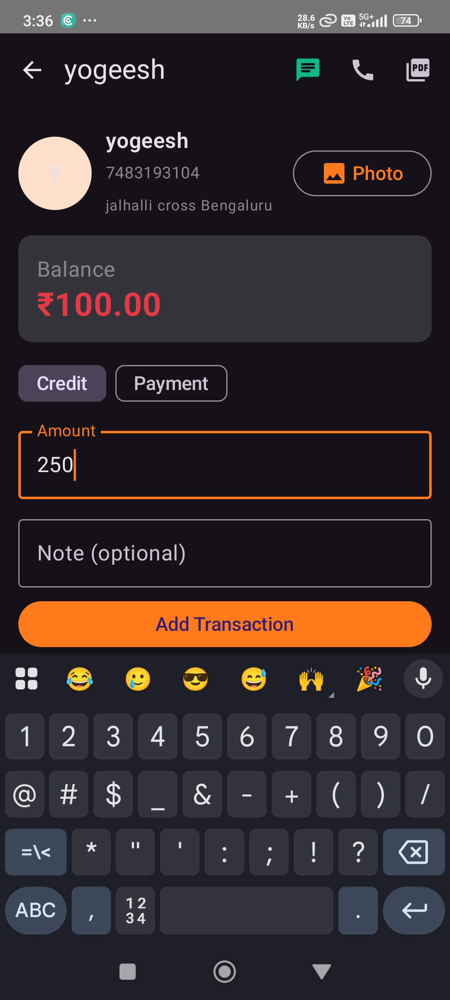 | 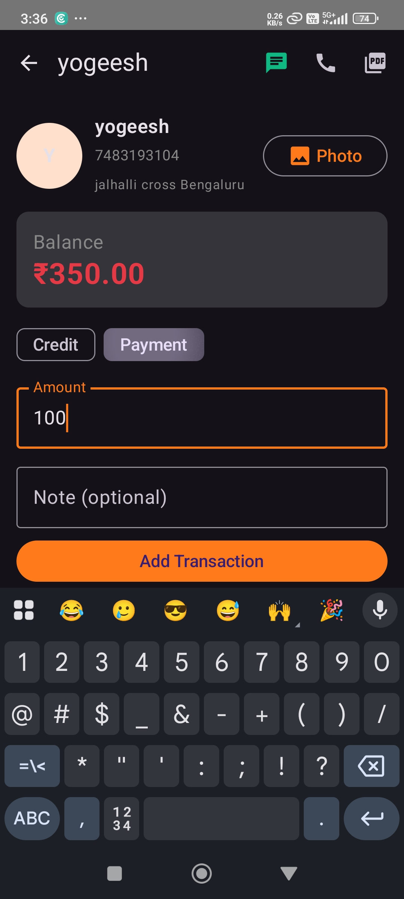 | 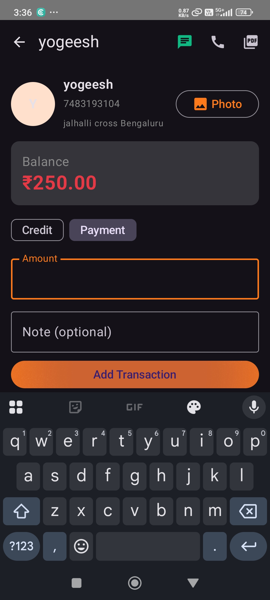 |
| *Detailed view of customer balance and history.* | *Fast numeric entry for adding credits or payments.* | *Instant recalculation of outstanding amounts.* |

### 🛡️ Verification & Security
| Transaction QR | Recent Activity | App Settings |
|:---:|:---:|:---:|
| 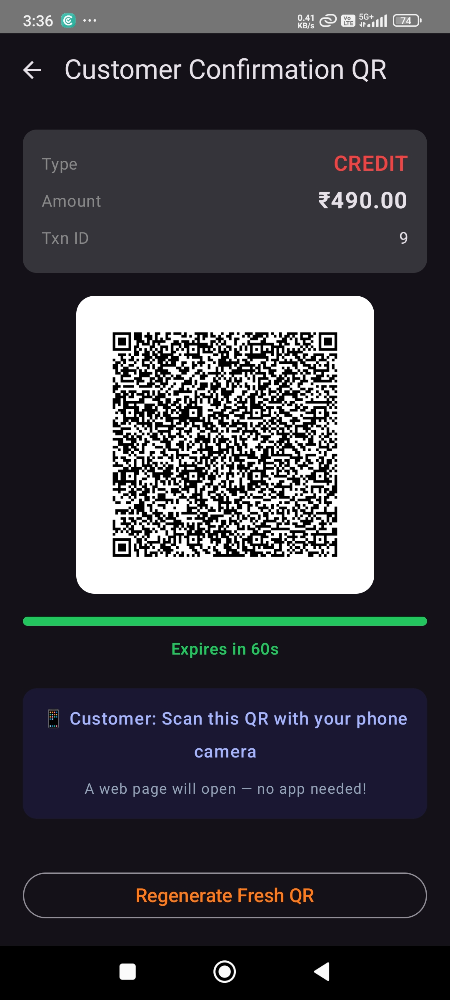 | 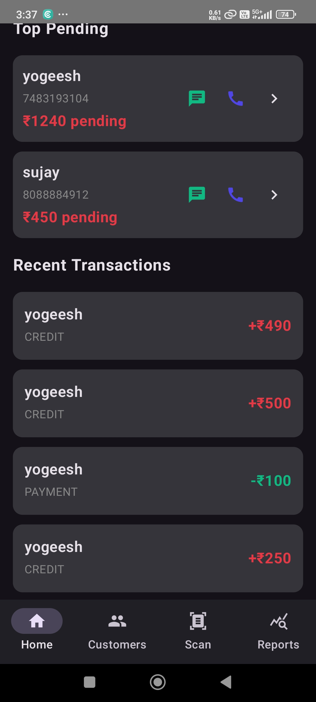 | 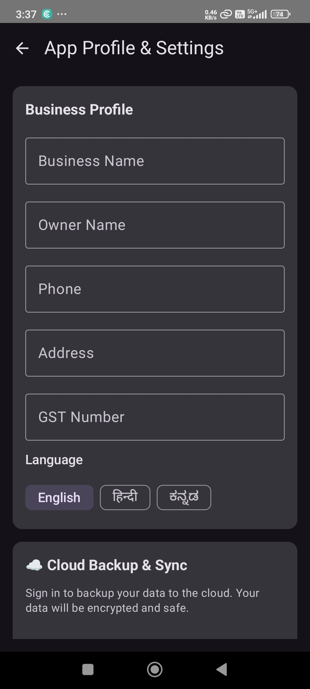 |
| *Secure QR code for customer confirmation.* | *Home screen view of latest transaction logs.* | *Business profile and language preferences.* |

### 📈 Reports & Analytics
| Daily Trends | Collections vs Outstanding | Summary Table |
|:---:|:---:|:---:|
| 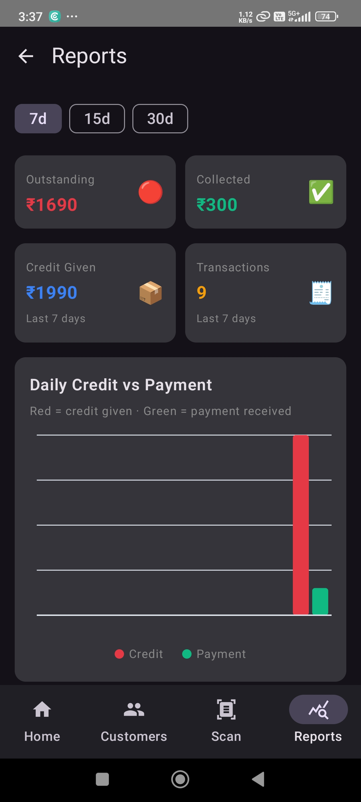 | 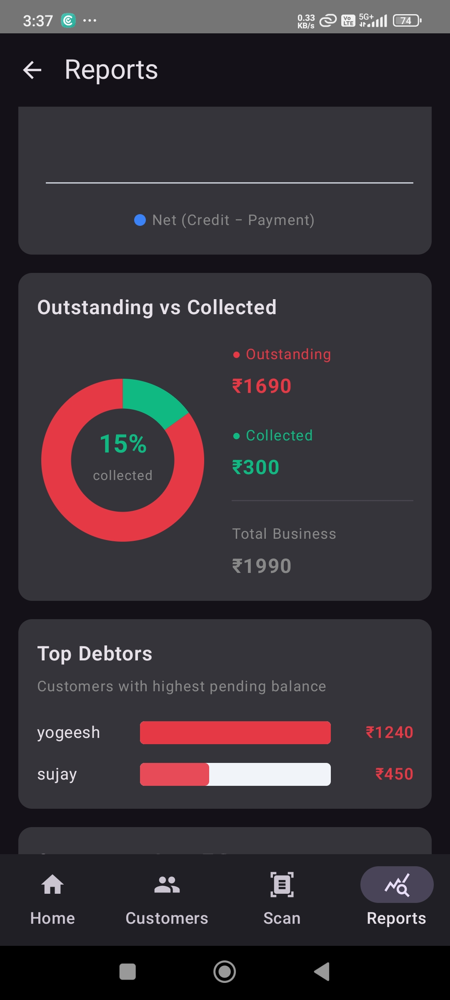 | 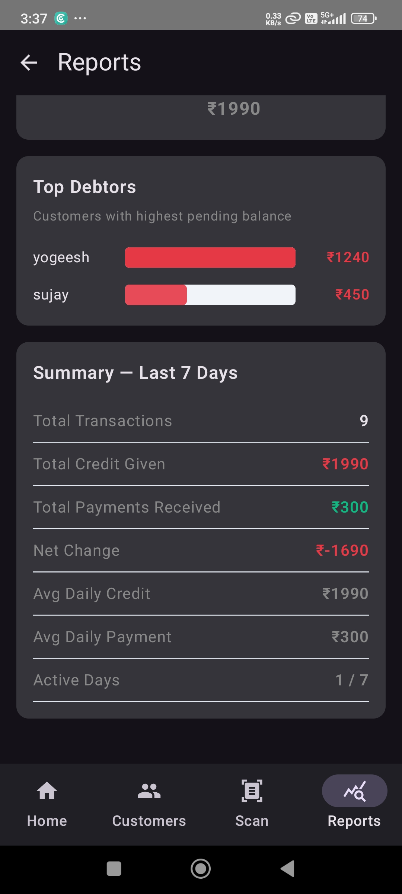 |
| *Visual trends of credits vs payments over time.* | *Pie chart breakdown of collection performance.* | *Detailed text summary of 7/15/30 day activity.* |

### 📄 Documentation & Exporting
| Single Invoice | Sharing on WhatsApp | Full Ledger Export |
|:---:|:---:|:---:|
| 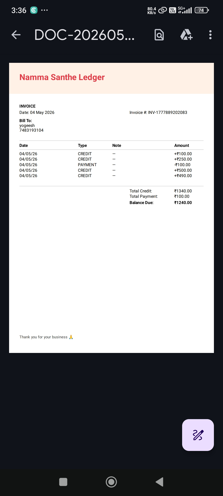 | 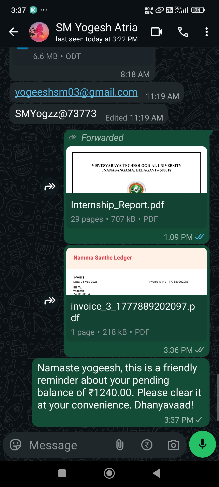 | 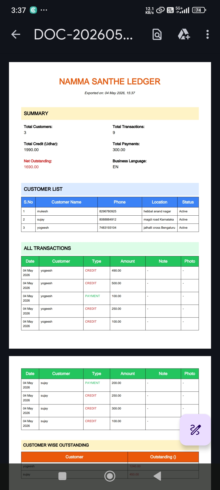 |
| *Professional PDF invoice for specific transactions.* | *Direct integration for sharing statements with customers.* | *Comprehensive ledger report for business records.* |

| Data Export Options | PDF Page 2 |
|:---:|:---:|
| 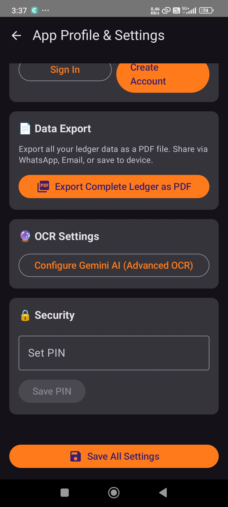 | 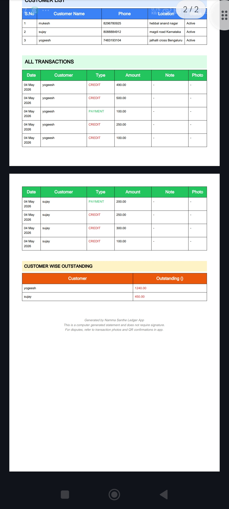 |
| *Settings for full data backup and PDF exports.* | *Continuation of the detailed transaction ledger.* |

---

## 🚀 Download & Installation (APK)

The compiled Android APK can be found locally after a build in the following directory:
```bash
android/app/build/outputs/apk/debug/app-debug.apk
https://github.com/SMVINAYKUMAR2341/MindMatrix-NammaSanthe-Ledger/tree/main/releases
```

**For GitHub Users:** 
Since the APK is ~117MB and exceeds standard Git limits, please check the [Releases](../../releases) section of this repository to download the latest `.apk` file directly to your Android device.

---

## ✨ Core Features

1. **Quick Entry Numeric Keypad**: Specifically designed for <5 second transaction entries.
2. **Offline-First Storage**: Full application functionality without requiring an active internet connection (powered by Room DB).
3. **Customer Management**: Add customers, capture profile photos, and track individual balances.
4. **OCR Bill Scanning (Gemini ML Kit)**: Automatically extract text from handwritten bills and invoices using device camera.
5. **QR Confirmation**: Generate secure, tamper-proof QR codes to confirm transactions via a secondary device.
6. **PDF Ledger Export**: Complete ledger and invoice exporting as shareable PDFs (iText7).
7. **Cloud Sync (Optional)**: Firebase Authentication and Firestore backup to safely sync data across devices.

---

## 🏗️ Technical Architecture & Stack

- **Platform**: Android (Kotlin)
- **UI Toolkit**: Jetpack Compose
- **Architecture Pattern**: MVVM (Model-View-ViewModel) + Clean Architecture
- **Local Database**: Room (SQLite)
- **Image Loading**: Coil
- **Cloud/Backend**: Firebase (Auth, Firestore)
- **Camera/Scanning**: CameraX, ZXing (QR)
- **Document Generation**: iText7

---

## 📂 Key Kotlin Components Info

### 1. Presentation Layer (Jetpack Compose)
- **`HomeScreen.kt`**: Main dashboard showing quick stats (Total, Today, Overdue).
- **`CustomerScreen.kt`**: Interface for adding/editing customers and viewing customer lists.
- **`LedgerScreen.kt`**: Transaction history, balance display, and adding new credit/payment entries.
- **`ScannerScreen.kt` / `QrDisplayScreen.kt`**: QR Code scanning and generation screens.
- **`OcrScreen.kt`**: Camera interface for capturing bills.

### 2. ViewModel Layer (MVVM)
- **`LedgerViewModel.kt`**: Manages StateFlows for customers, transactions, and balances. Handles business logic for adding transactions.
- **`ProfileViewModel.kt`**: Manages authentication state, PDF exports, and Cloud Backup operations.
- **`OcrViewModel.kt`**: Handles OCR processing via GeminiService, parsing extracted text into transaction items.
- **`ConfirmationViewModel.kt`**: Controls QR generation and trust-level assessment during transaction confirmations.

### 3. Repository Layer
- **`LedgerRepository.kt`**: Interfaces with Room DAOs (`CustomerDao`, `TransactionDao`). Handles CRUD operations and local caching.
- **`FirebaseSyncManager.kt` & `FirebaseAuthManager.kt`**: Handles cloud synchronization, restores, and user authentication.
- **`DataExportManager.kt`**: Handles PDF generation using iText7 and handles file sharing intents.

### 4. Service Classes
- **`GeminiService.kt`**: Communicates with ML Kit/Gemini for OCR and parses Kannada text.
- **`QrGenerator.kt` & `QrValidator.kt`**: Generates QR payloads with cryptographic hashes and validates scanned payloads.
- **`PhotoManager.kt`**: Manages CameraX photo capture, image compression, and private file storage.

---

## 🛠️ Setup Instructions for Developers

1. Clone the repository:
   ```bash
   git clone https://github.com/SMVINAYKUMAR2341/MindMatrix-NammaSanthe-Ledger.git
   ```
2. Open the `android/` folder in **Android Studio**.
3. Sync Gradle files.
4. Set up your `local.properties` file with necessary API keys (like Gemini API key) if required.
5. Build and run the app on an emulator or physical device.

---
*Generated for the Namma-Santhe Ledger Project.*
