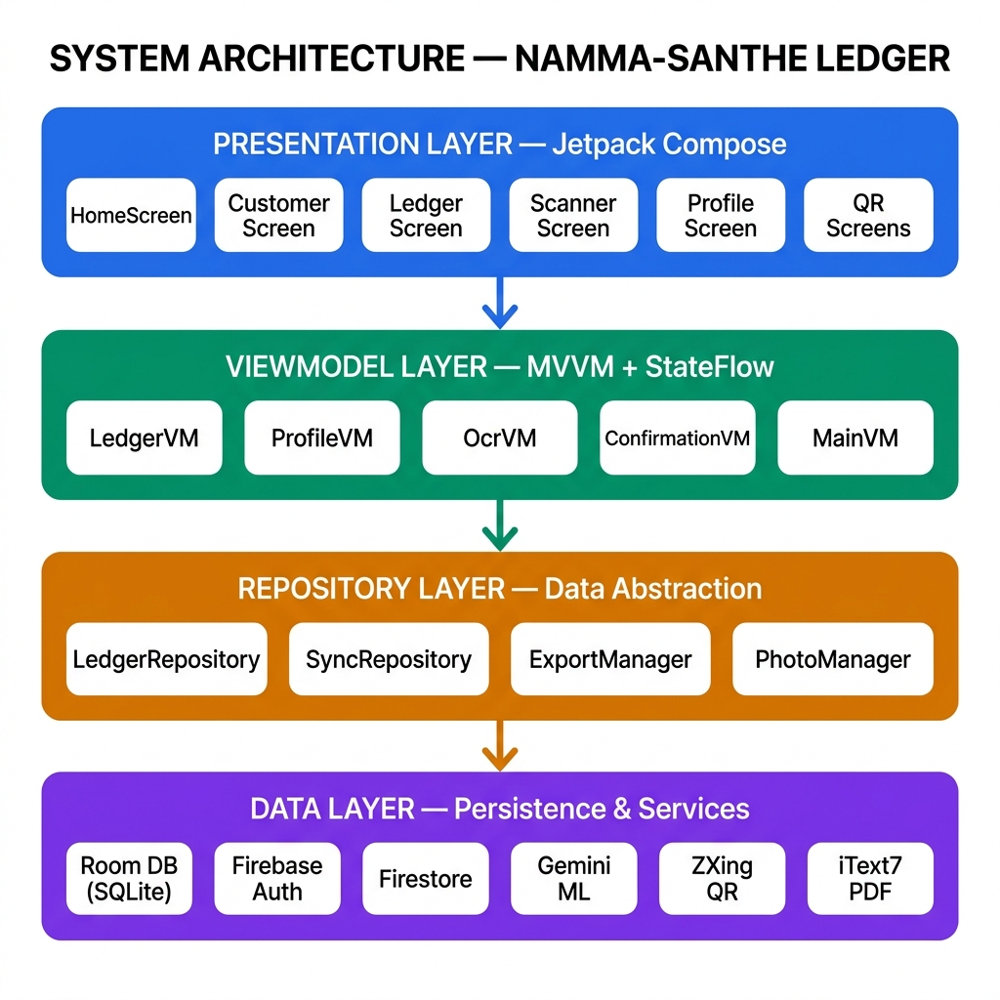
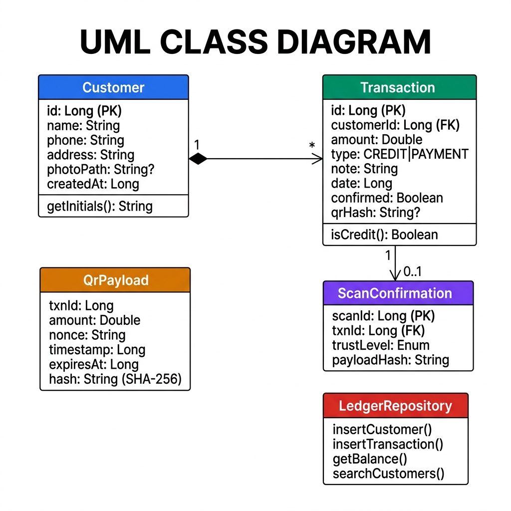
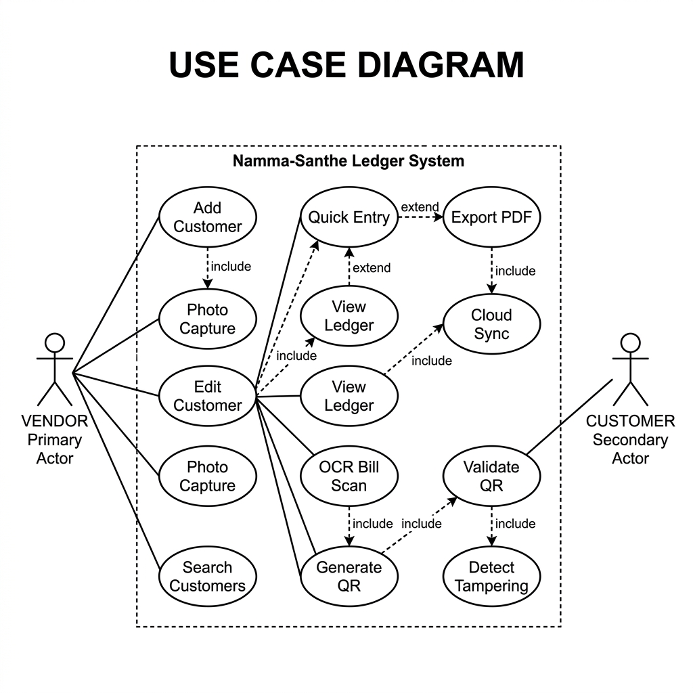
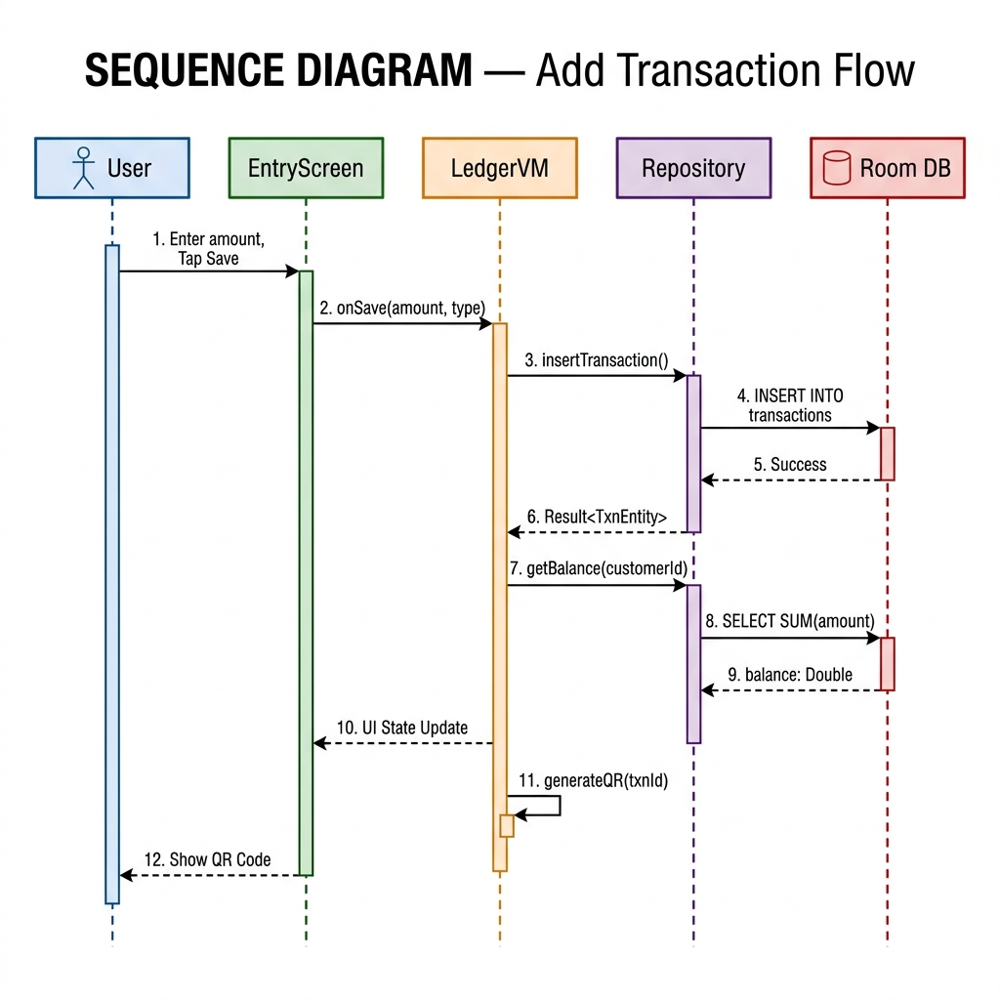
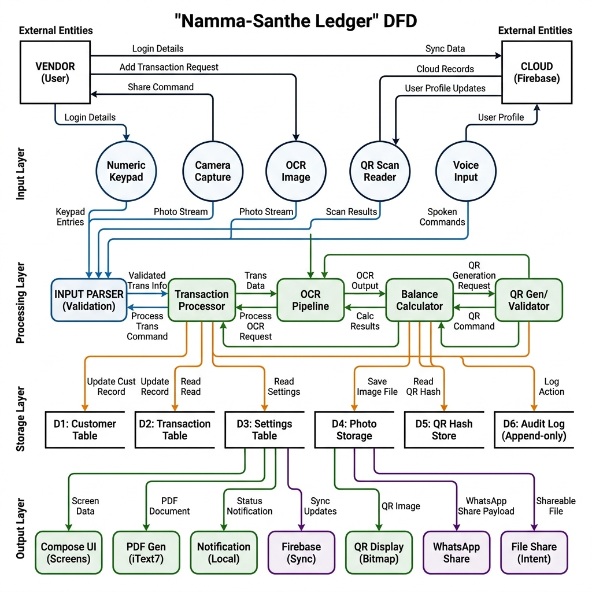
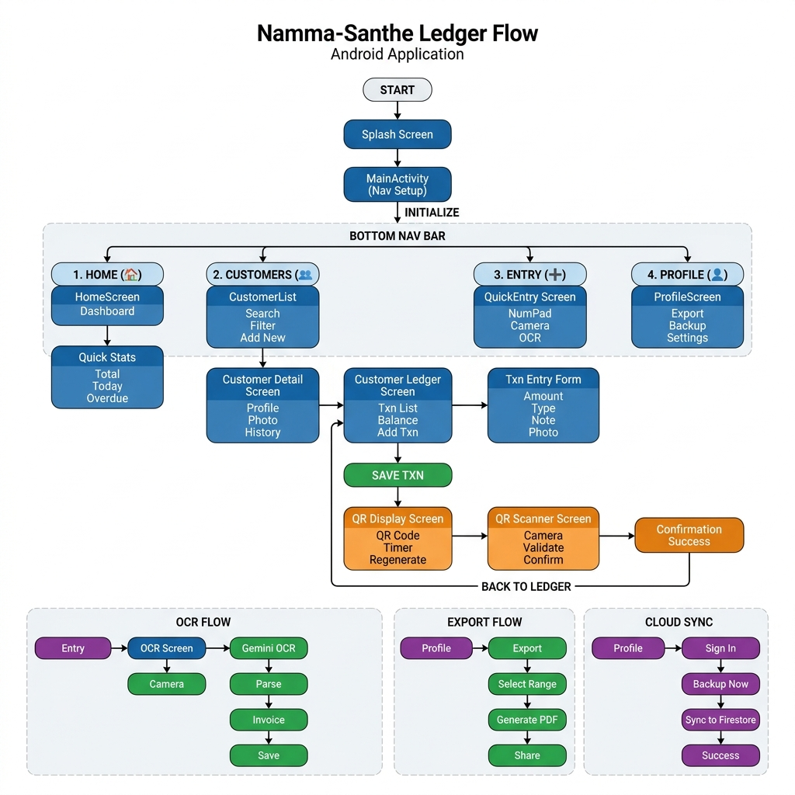
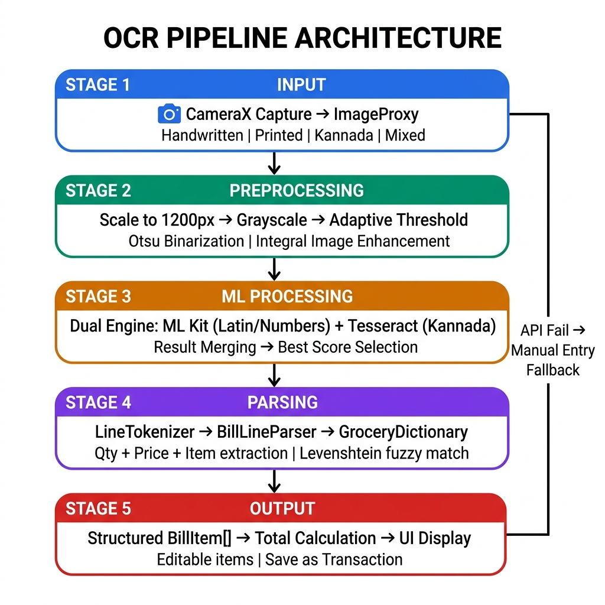
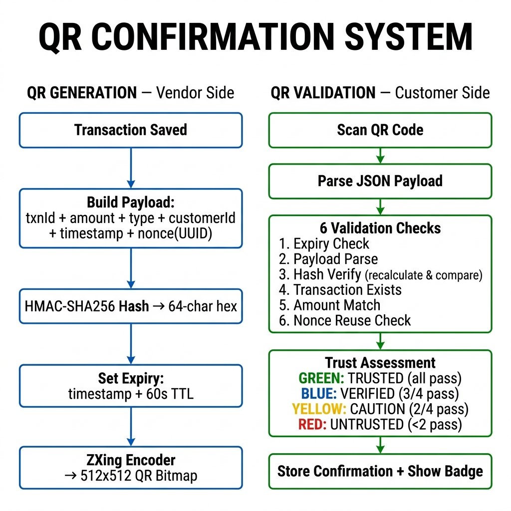
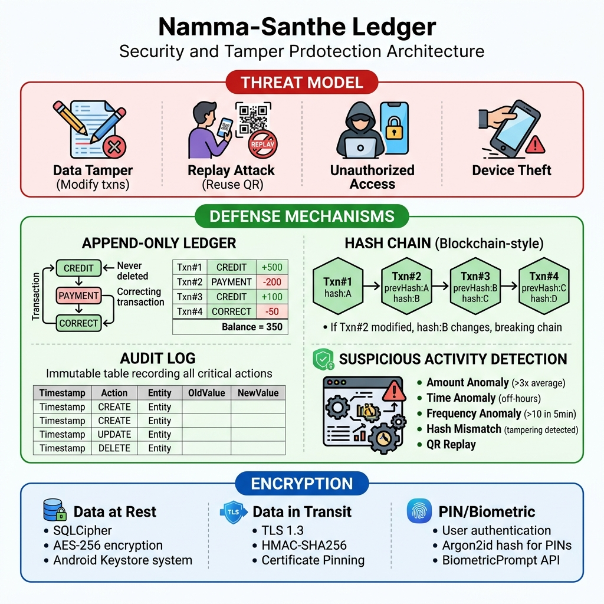
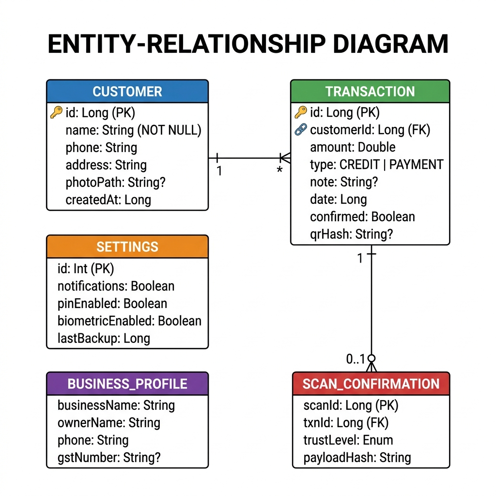

---
pdf_options:
  format: A4
  margin: 25mm 20mm
  printBackground: true
  headerTemplate: '<div style="font-size:8px;width:100%;text-align:center;color:#999;">Namma-Santhe Ledger — Technical Documentation</div>'
  footerTemplate: '<div style="font-size:8px;width:100%;text-align:center;color:#999;"><span class="pageNumber"></span> / <span class="totalPages"></span></div>'
  displayHeaderFooter: true
stylesheet: https://cdnjs.cloudflare.com/ajax/libs/github-markdown-css/5.2.0/github-markdown.min.css
body_class: markdown-body
---

<div style="text-align:center; padding: 80px 0 40px 0;">

# 📗 Namma-Santhe Ledger

## Technical Documentation Report

---

**Platform:** Android (Kotlin, Jetpack Compose)  
**Architecture:** MVVM + Clean Architecture  
**Type:** Offline-first digital ledger app for rural vendors  

**Prepared for:** Academic & Evaluation Purposes  
**Date:** May 2026  

</div>

<div style="page-break-after: always;"></div>

## Table of Contents

1. [System Overview](#1-system-overview)
2. [System Architecture Diagram](#2-system-architecture-diagram)
3. [UML Class Diagram](#3-uml-class-diagram)
4. [Use Case Diagram](#4-use-case-diagram)
5. [Sequence Diagrams](#5-sequence-diagrams)
6. [Data Flow Diagram (DFD)](#6-data-flow-diagram)
7. [App Navigation Flow](#7-app-navigation-flow)
8. [OCR Pipeline Architecture](#8-ocr-pipeline-architecture)
9. [QR Confirmation System](#9-qr-confirmation-system)
10. [Security & Tamper Protection](#10-security--tamper-protection)
11. [Entity-Relationship Diagram](#11-entity-relationship-diagram)
12. [Project Structure](#12-project-structure)
13. [Technology Stack Summary](#13-technology-stack-summary)

<div style="page-break-after: always;"></div>

---

## 1. System Overview

### Brief Description

Namma-Santhe Ledger is an Android application designed for small-scale vendors in rural Indian markets ("santhe") to digitize their credit tracking operations. The app replaces traditional paper-based "udari" (credit) tracking with a mobile-first, offline-capable solution.

### Problem Statement

- **Pain Point**: Rural vendors maintain handwritten ledgers for credit transactions
- **Challenges**:
  - Lost/damaged paper records
  - Difficulty tracking outstanding payments
  - No backup mechanism
  - Calculation errors
  - Delayed payments due to poor record visibility

### Solution

An offline-first Android app with:
- Digital ledger with automatic balance calculation
- Customer photo capture for identification
- QR-based transaction confirmation
- OCR bill scanning for quick entry
- Cloud backup via Firebase (optional)
- PDF export for sharing

### Key Features

| Feature | Description | Tech Stack |
|---------|-------------|------------|
| Quick Entry | Numeric keypad for <5 sec transaction entry | Jetpack Compose |
| Customer Mgmt | Photo capture, search, profile | CameraX, Coil |
| Credit Tracking | Auto-calculated outstanding balances | Room DB |
| QR Confirmation | Tamper-proof transaction verification | ZXing, Custom Hash |
| OCR Bill Scan | Extract text from handwritten bills | Gemini ML Kit |
| Cloud Sync | Firebase Auth + Firestore backup | Firebase |
| PDF Export | Complete ledger as shareable PDF | iText7 |
| Offline Mode | Full functionality without internet | Room DB |

<div style="page-break-after: always;"></div>

---

## 2. System Architecture Diagram

The application follows a **4-layer architecture** pattern with clear separation of concerns:

- **Presentation Layer** — Jetpack Compose UI screens
- **ViewModel Layer** — MVVM state management with StateFlow
- **Repository Layer** — Data access abstraction
- **Data Layer** — Room DB, Firebase, Local Files, External Services



**Key Points:**
- All UI is built with Jetpack Compose (declarative)
- ViewModels expose StateFlow for reactive UI updates
- Repositories abstract data sources (local DB vs cloud)
- External services (Gemini OCR, ZXing QR, iText7 PDF) are isolated in the data layer

<div style="page-break-after: always;"></div>

---

## 3. UML Class Diagram

The class structure is organized into **four groups**: Entity Classes, QR Security Classes, Repository Classes, and ViewModel Classes.



### Key Relationships

| Relationship | Type | Description |
|-------------|------|-------------|
| Customer → Transaction | One-to-Many | Each customer has multiple transactions |
| ViewModel → Repository | Dependency | ViewModels access data through repositories |
| Repository → DAO | Dependency | Repositories use Room DAOs for DB access |
| QrGenerator → QrPayload | Creates | Generator builds signed payloads |
| QrValidator → QrPayload | Validates | Validator verifies payload integrity |
| ConfirmationVM → QrGenerator | Uses | ViewModel delegates QR creation |
| OcrViewModel → GeminiService | Uses | ViewModel delegates OCR processing |

<div style="page-break-after: always;"></div>

---

## 4. Use Case Diagram

The system has two actors: **Vendor** (primary) and **Customer** (secondary).



### Actor Responsibilities

**Vendor (Primary Actor):**
- Manage Customers (Add, Edit, Photo Capture, Search)
- Process Transactions (Quick Entry, View Ledger, OCR Scan, QR Confirm)
- Backup & Export (Export PDF, Cloud Sync, Share via WhatsApp, Restore)

**Customer (Secondary Actor):**
- Scan QR to Confirm Transaction

### Key Relationships

- Vendor →`<<include>>`→ Calculate Balance (auto on transaction)
- Vendor →`<<include>>`→ Generate QR (on transaction save)
- Vendor →`<<extend>>`→ OCR Scan (optional entry method)
- Customer →`<<include>>`→ Validate QR (required for confirmation)
- Cloud Sync →`<<include>>`→ Hash Chain Validation
- Export PDF →`<<include>>`→ Calculate Balance

<div style="page-break-after: always;"></div>

---

## 5. Sequence Diagrams

### 5.1 Add Transaction Flow

The primary flow for adding a new credit/payment transaction:



**Flow Summary:**
1. User enters amount and taps Save
2. Entry Screen calls `onSave()` on LedgerVM
3. LedgerVM inserts transaction via Repository → Room DB
4. Balance is recalculated via SUM query
5. UI updates with new balance
6. QR code is generated for the transaction
7. QR is displayed for customer confirmation

### 5.2 OCR Invoice Flow

1. User taps OCR → Camera opens (CameraX)
2. User captures bill photo
3. Photo sent to Gemini ML API for OCR
4. Raw text extracted and parsed into line items
5. User reviews/edits extracted items
6. Saved as transaction

### 5.3 QR Confirmation Flow

1. Vendor saves transaction → QR generated with SHA-256 hash
2. QR displayed on vendor's screen with 60-second expiry timer
3. Customer scans QR using their phone
4. System validates: expiry, hash, amount match, reuse check
5. Trust level assessed (Trusted/Verified/Caution/Untrusted)
6. Transaction marked as confirmed with trust badge

<div style="page-break-after: always;"></div>

---

## 6. Data Flow Diagram

### Level 0 (Context Diagram)

Three entities: **Vendor** ↔ **Namma-Santhe Ledger System** ↔ **Firebase Cloud**, with **Local SQLite DB** as the central data store.

### Level 1 (Detailed DFD)



**Data Stores:**

| Store | Name | Description |
|-------|------|-------------|
| D1 | Customer DB | Customer profiles and photos |
| D2 | Transaction DB | All credit/payment records |
| D3 | Photo Files | Compressed customer/bill images |
| D4 | Settings DB | App configuration and preferences |
| D5 | QR Hash Store | Used nonces and hash records |
| D6 | Audit Log | Append-only activity log |

<div style="page-break-after: always;"></div>

---

## 7. App Navigation Flow



### Navigation Structure

**Bottom Navigation Bar (4 tabs):**
1. **Home** 🏠 — Dashboard with quick stats (total, today, overdue)
2. **Customers** 👥 — Customer list with search/filter → Detail → Ledger
3. **Entry** ➕ — Quick transaction entry (NumPad, Camera, OCR)
4. **Profile** 👤 — Export, backup, settings

**Additional Flows:**
- **OCR Flow:** Entry → OCR Screen → Camera → Gemini OCR → Parse → Invoice → Save
- **Export Flow:** Profile → Export → Select Range → Generate PDF → Share
- **Cloud Sync:** Profile → Sign In → Backup Now → Sync to Firestore → Success

<div style="page-break-after: always;"></div>

---

## 8. OCR Pipeline Architecture



### Pipeline Stages

| Stage | Component | Function |
|-------|-----------|----------|
| 1. Input | CameraX | Captures bill image (handwritten/printed/Kannada) |
| 2. Preprocessing | Image Preprocessor | Resize, normalize, enhance, Base64 encode |
| 3. ML Processing | Gemini 2.5 Flash | API call with OCR prompt for text extraction |
| 4. Parsing | Text Normalizer + Line Parser | Clean OCR errors, regex parse (item+qty+price) |
| 5. Output | JSON Formatter | Structured items array with total, editable UI |

### Error Handling
- API Failure → Falls back to manual entry
- Parse Error → Shows raw text for manual editing
- Retry/Skip options available at each stage

<div style="page-break-after: always;"></div>

---

## 9. QR Confirmation System



### QR Generation (Vendor Side)

1. **Payload Creation:** txnId, amount, type, customerId, timestamp, nonce (UUID v4)
2. **Hash Calculation:** SHA-256(txnId + amount + type + customerId + timestamp + nonce + SECRET_KEY) → 64-char hex
3. **Expiry:** timestamp + 60 seconds TTL
4. **QR Bitmap:** ZXing encoder, 512×512px, UTF-8, Error Correction Level H (30%)

### QR Validation (Customer Side)

6 validation checks performed in sequence:

| Check | Validation | Reject Condition |
|-------|-----------|-----------------|
| 1 | Expiry Check | currentTime > expiresAt |
| 2 | Payload Parse | Malformed JSON |
| 3 | Hash Verify | Recalculated hash ≠ stored hash |
| 4 | Txn Exists | txnId not found in DB |
| 5 | Amount Match | QR amount ≠ DB amount |
| 6 | Reuse Check | Nonce already used |

### Trust Levels

| Level | Condition | Badge Color |
|-------|-----------|-------------|
| TRUSTED | All 4 checks pass | 🟢 Green |
| VERIFIED | 3/4 checks pass | 🔵 Blue |
| CAUTION | 2/4 checks pass | 🟡 Yellow |
| UNTRUSTED | <2 checks pass | 🔴 Red |

<div style="page-break-after: always;"></div>

---

## 10. Security & Tamper Protection



### Threat Model

| Threat | Description | Mitigation |
|--------|-------------|------------|
| Data Tampering | Modifying transaction records | Hash chain, append-only ledger |
| Replay Attack | Reusing scanned QR codes | Nonce tracking, expiry timer |
| Unauthorized Access | Accessing app without permission | PIN/Biometric authentication |
| Device Theft | Physical device compromise | Encrypted storage, remote wipe |

### Defense Mechanisms

**1. Append-Only Ledger** — Transactions are NEVER deleted or modified. Corrections create new entries.

**2. Hash Chain (Blockchain-style)** — Each transaction's hash includes the previous transaction's hash. If any record is modified, the chain breaks.

**3. Audit Log** — Immutable, append-only log of all actions (CREATE, UPDATE, DELETE) with old/new values.

**4. Suspicious Activity Detection:**
- Amount > 3× average → Flag
- Off-hours transactions (8PM–6AM) → Flag
- \>10 txns in 5 minutes → Flag burst activity
- Hash mismatch → Alert tampering, disable sync
- Nonce reuse → Reject QR, log replay attempt

### Encryption

| Layer | Technology | Details |
|-------|-----------|---------|
| Data at Rest | SQLCipher + AES-256 | Room DB encrypted, photos encrypted in private storage |
| Data in Transit | TLS 1.3 + HMAC-SHA256 | Firebase auto-TLS, QR payloads signed, cert pinning |
| Authentication | Argon2id + BiometricPrompt | Memory-hard PIN hash, Android biometric API |
| Key Storage | Android Keystore | Hardware-backed when available |

<div style="page-break-after: always;"></div>

---

## 11. Entity-Relationship Diagram



### Database Tables

**Customer Table:**
`id (PK)`, `name`, `phone`, `address`, `photoPath?`, `createdAt`, `lastUpdated`

**Transaction Table:**
`id (PK)`, `customerId (FK→Customer)`, `amount`, `type (CREDIT/PAYMENT)`, `note`, `date`, `photoPath?`, `confirmed`, `qrHash?`, `createdAt`

**Settings Table:**
`id (PK)`, `notifications`, `overdueThreshold`, `overdueDays`, `pinEnabled`, `pinHash?`, `biometricEnabled`, `lastBackup`

**BusinessProfile Table:**
`businessName`, `ownerName`, `phone`, `address`, `gstNumber?`, `terms`

**ScanConfirmation Table:**
`scanId (PK)`, `txnId (FK→Transaction)`, `scannedAt`, `scannerDeviceId`, `trustLevel`, `payloadHash`

### Relationships
- **Customer 1 ←→ \* Transaction** (One customer has many transactions)
- **Transaction 1 ←→ 0..1 ScanConfirmation** (A transaction may have one confirmation)

<div style="page-break-after: always;"></div>

---

## 12. Project Structure

```
app/
├── src/main/java/com/nammasanthe/ledger/
│   ├── MainActivity.kt              # Entry point, Navigation setup
│   ├── data/
│   │   ├── database/
│   │   │   ├── AppDatabase.kt       # Room database
│   │   │   ├── Converters.kt        # Type converters
│   │   │   └── migrations/          # Migration scripts
│   │   ├── entity/
│   │   │   ├── Customer.kt          # Customer entity
│   │   │   ├── TxnEntity.kt         # Transaction entity
│   │   │   ├── BusinessProfile.kt   # Settings entity
│   │   │   └── Confirmation.kt      # QR confirmation entity
│   │   └── dao/
│   │       ├── CustomerDao.kt       # Customer queries
│   │       ├── TransactionDao.kt    # Transaction queries
│   │       └── SettingsDao.kt       # Settings queries
│   ├── repository/
│   │   ├── LedgerRepository.kt      # Main data operations
│   │   ├── CustomerRepository.kt    # Customer operations
│   │   └── DataExportManager.kt     # PDF export logic
│   ├── viewmodel/
│   │   ├── LedgerViewModel.kt       # Ledger screen logic
│   │   ├── ProfileViewModel.kt      # Profile & auth logic
│   │   ├── ConfirmationViewModel.kt # QR generation/scan
│   │   └── OcrViewModel.kt          # OCR processing
│   ├── ui/
│   │   ├── screens/                 # All Compose screens
│   │   ├── components/              # Reusable UI components
│   │   ├── nav/Routes.kt            # Navigation routes
│   │   └── theme/                   # Colors, Theme, Typography
│   ├── sync/
│   │   ├── FirebaseAuthManager.kt   # Firebase authentication
│   │   └── FirebaseSyncManager.kt   # Cloud sync logic
│   ├── security/
│   │   ├── QrGenerator.kt           # QR code generation
│   │   ├── QrValidator.kt           # QR validation logic
│   │   └── QrScannerAnalyzer.kt     # Camera QR scanning
│   ├── gemini/
│   │   └── GeminiService.kt         # Gemini OCR API
│   └── util/
│       ├── PhotoManager.kt          # Photo handling
│       └── PdfGenerator.kt          # PDF generation
├── src/main/res/                    # Resources (drawable, values, xml)
└── build.gradle.kts                 # App dependencies
```

---

## 13. Technology Stack Summary

| Layer | Technology | Purpose |
|-------|-----------|---------|
| UI | Jetpack Compose | Modern declarative UI |
| State | Kotlin StateFlow | Reactive state management |
| Architecture | MVVM + Repository | Clean separation of concerns |
| Database | Room (SQLite) | Local data persistence |
| OCR | Gemini ML Kit | Text recognition from images |
| QR | ZXing | QR code generation/scanning |
| PDF | iText7 | PDF invoice generation |
| Auth | Firebase Auth | User authentication |
| Cloud | Firestore | Cloud data backup |
| Images | CameraX + Coil | Camera and image loading |
| DI | Manual (no Hilt) | Dependency injection |

---

<div style="text-align:center; padding: 40px 0;">

*Documentation generated for academic and evaluation purposes.*  
*Aligns with actual implementation in the Namma-Santhe Ledger Android application.*

**© 2026 Namma-Santhe Ledger Project**

</div>
